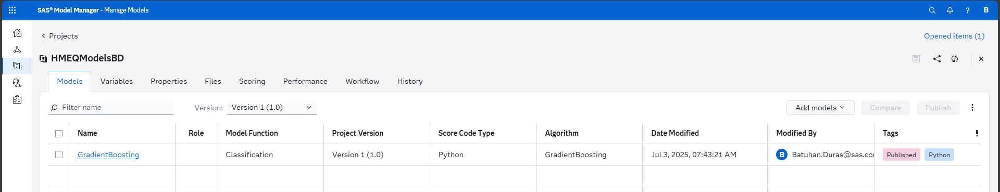
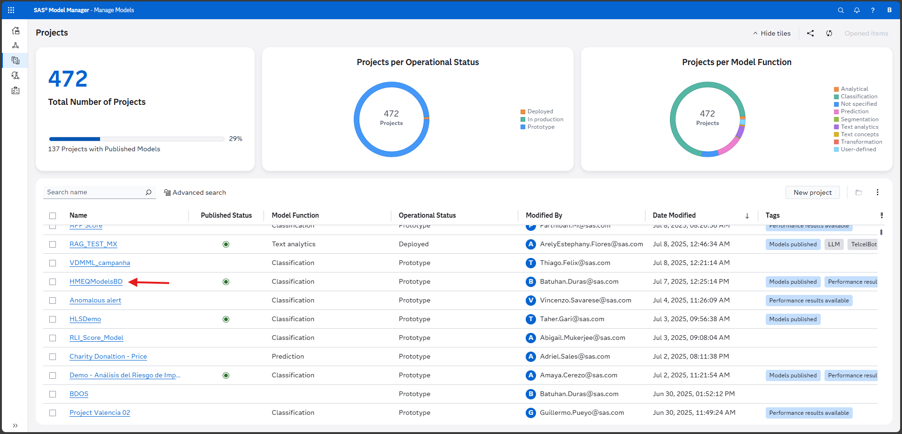
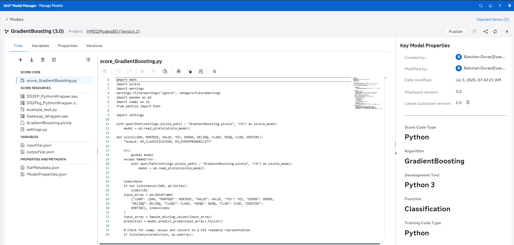
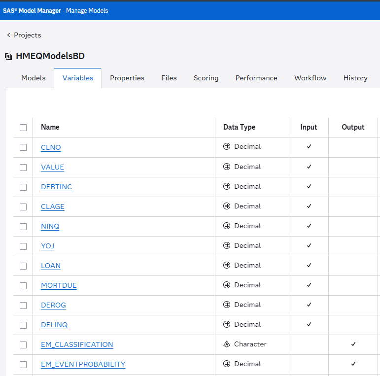

# SASCTL Guide: Open-Source Models with SAS Model Manager

## Overview

This guide demonstrates how to build **open-source machine learning models** in Python and deploy them to **SAS Model Manager** using the **SASCTL** library. This approach is ideal for production model deployment, version control, and enterprise model management.

**Key Concept**: Build models with scikit-learn, serialize them for SAS, and deploy to Model Manager for enterprise scoring and monitoring.

## Prerequisites

- Python 3.8+
- Access to SAS Model Manager
- SAS credentials for OAuth2 authentication

## Installation

### 1. Create Virtual Environment
```bash
python -m venv venv
venv\Scripts\activate  # Windows
# or
source venv/bin/activate  # Linux/Mac
```

### 2. Install Dependencies
```bash
pip install -r requirements.txt
```

### 3. Environment Setup
Create `.env` file:
```env
SAS_CLIENT_ID=your_client_id_here
SAS_CLIENT_SECRET=your_client_secret_here
SAS_BASE_URL=https://create.demo.sas.com
SAS_CERT_PATH=C:/sas/model-manager/demo-rootCA-Intermidiates_4CLI.pem
```

## Step-by-Step Implementation

### Step 1: Authentication Setup

Create `auth_utils.py`:
```python
import requests
import os
import base64
from dotenv import load_dotenv

load_dotenv()

def get_token():
    """Get OAuth2 access token for SAS Cloud"""
    # Implementation for token generation/refresh
    # See auth_utils.py in the project for full implementation
    pass
```

### Step 2: Data Loading

Create `data_loading.py`:
```python
import pandas as pd

def load_data(path):
    """Read CSV and return DataFrame"""
    return pd.read_csv(path, sep=",")
```

### Step 3: Data Preprocessing

Create `preprocessing.py`:
```python
import pandas as pd
from sklearn.model_selection import train_test_split
from sklearn.impute import SimpleImputer

def split_and_impute(df, predictors, target, test_size=0.3, random_state=42):
    """Split data and handle missing values"""
    
    # Separate features and target
    X = df[predictors]
    y = df[target]
    
    # Split data
    X_train, X_test, y_train, y_test = train_test_split(
        X, y, test_size=test_size, random_state=random_state
    )
    
    # Handle missing values
    imputer = SimpleImputer(strategy='mean')
    X_train_imputed = pd.DataFrame(
        imputer.fit_transform(X_train),
        columns=X_train.columns
    )
    X_test_imputed = pd.DataFrame(
        imputer.transform(X_test),
        columns=X_test.columns
    )
    
    return X_train_imputed, X_test_imputed, y_train, y_test
```

### Step 4: Model Training

Create `training.py`:
```python
from sklearn.ensemble import GradientBoostingClassifier

def train_gbc(X_train, y_train, params):
    """Train Gradient Boosting Classifier"""
    model = GradientBoostingClassifier(**params)
    model.fit(X_train, y_train)
    return model
```

### Step 5: Model Evaluation

Create `evaluation.py`:
```python
import numpy as np

def evaluate(model, X_test, y_test):
    """Evaluate model performance"""
    y_pred = model.predict(X_test)
    y_proba = model.predict_proba(X_test)
    
    # Calculate accuracy
    accuracy = (y_pred == y_test).mean()
    print(f"Model Accuracy: {accuracy:.4f}")
    
    return y_pred, y_proba
```

### Step 6: Model Serialization

Create `serialization.py`:
```python
import os
import pickle
import json
from datetime import datetime

def serialize_model(model, predictors, sample_data, output_dir, model_type):
    """Serialize model for SAS Model Manager"""
    
    # Create output directory
    os.makedirs(output_dir, exist_ok=True)
    
    # Save model as pickle
    model_path = os.path.join(output_dir, f"{model_type}_model.pkl")
    with open(model_path, 'wb') as f:
        pickle.dump(model, f)
    
    # Create metadata
    metadata = {
        "model_type": model_type,
        "predictors": predictors,
        "target": "BAD",
        "created_date": datetime.now().isoformat(),
        "sample_data": sample_data.head().to_dict()
    }
    
    metadata_path = os.path.join(output_dir, "metadata.json")
    with open(metadata_path, 'w') as f:
        json.dump(metadata, f, indent=2)
    
    print(f"✅ Model serialized to: {output_dir}")
    return model_path, metadata_path
```

### Step 7: Model Import to SAS

Create `import_model.py`:
```python
import sasctl
from sasctl import Session, register_model, publish_model
from sasctl.services import model_repository as mr
from sasctl.services import model_management as mm
import pandas as pd

def import_to_model_manager(input_data, model_prefix, project, serialization_path, 
                           predict_method, score_metrics, missing_values, host, protocol):
    """Import model to SAS Model Manager"""
    
    # Connect to SAS
    Session(host, username=None, password=None, protocol=protocol)
    
    # Create or get project
    try:
        project_obj = mr.get_project(project)
    except:
        project_obj = mr.create_project(project, description=f"{project} Models")
    
    # Register model
    model_name = f"{model_prefix}_Model"
    model_obj = register_model(
        model=serialization_path,
        name=model_name,
        project=project,
        input_data=input_data,
        predict_method=predict_method,
        score_metrics=score_metrics,
        missing_values=missing_values
    )
    
    # Publish model
    published_model = publish_model(model_obj, "maslocal")
    
    print(f"✅ Model '{model_name}' published to {project}")
    return published_model
```

### Step 8: Configuration Management

Create `config/params.yaml`:
```yaml
data:
  path: "data/your_dataset.csv"
model:
  type: "GradientBoosting"
  params:
    learning_rate: 0.1
    n_estimators: 100
    max_depth: 3
    random_state: 42
preprocessing:
  test_size: 0.3
  random_state: 42
serialization:
  output_dir: "models/your_model"
sas:
  host: "create.demo.sas.com"
  protocol: "https"
```

### Step 9: Main Pipeline

Create `run_pipeline.py`:
```python
import yaml
import argparse
import logging

from data_loading import load_data
from preprocessing import split_and_impute
from training import train_gbc
from evaluation import evaluate
from serialization import serialize_model
from import_model import import_to_model_manager

logging.basicConfig(level=logging.INFO)
logger = logging.getLogger(__name__)

def main(skip_import=False):
    # 1. Load config
    cfg = yaml.safe_load(open("config/params.yaml"))
    
    # 2. Load data
    df = load_data(cfg["data"]["path"])
    predictors = ["feature1", "feature2", "feature3"]  # Define your predictors
    
    # 3. Preprocess
    X_train, X_test, y_train, y_test = split_and_impute(
        df, predictors, "target",
        cfg["preprocessing"]["test_size"],
        cfg["preprocessing"]["random_state"]
    )
    
    # 4. Train model
    model = train_gbc(X_train, y_train, cfg["model"]["params"])
    
    # 5. Evaluate
    y_pred, y_proba = evaluate(model, X_test, y_test)
    
    # 6. Serialize
    serialize_model(
        model,
        predictors,
        df,
        cfg["serialization"]["output_dir"],
        cfg["model"]["type"]
    )
    
    # 7. Import to SAS (optional)
    if not skip_import:
        import_to_model_manager(
            input_data=df[predictors],
            model_prefix=cfg["model"]["type"],
            project="YourProject",
            serialization_path=cfg["serialization"]["output_dir"],
            predict_method=[model.predict_proba, [int, int]],
            score_metrics=["EM_CLASSIFICATION", "EM_EVENTPROBABILITY"],
            missing_values=True,
            host=cfg["sas"]["host"],
            protocol=cfg["sas"]["protocol"]
        )

if __name__ == "__main__":
    parser = argparse.ArgumentParser()
    parser.add_argument("--skip-import", action="store_true", 
                       help="Skip SAS Model Manager import")
    args = parser.parse_args()
    main(skip_import=args.skip_import)
```

## Complete Example: HMEQ Dataset

Here's a complete working example using the HMEQ dataset:

```python
import yaml
import pandas as pd
from sklearn.ensemble import GradientBoostingClassifier
from sklearn.model_selection import train_test_split
from sklearn.impute import SimpleImputer
import sasctl
from sasctl import Session, register_model, publish_model

def main():
    # 1. Load data
    df = pd.read_csv("data/hmeq.csv")
    predictors = ["LOAN", "MORTDUE", "VALUE", "YOJ", "DEROG", "DELINQ", 
                  "CLAGE", "NINQ", "CLNO", "DEBTINC"]
    
    # 2. Preprocess
    X = df[predictors]
    y = df["BAD"]
    
    X_train, X_test, y_train, y_test = train_test_split(
        X, y, test_size=0.3, random_state=42
    )
    
    imputer = SimpleImputer(strategy='mean')
    X_train_imputed = pd.DataFrame(
        imputer.fit_transform(X_train),
        columns=X_train.columns
    )
    X_test_imputed = pd.DataFrame(
        imputer.transform(X_test),
        columns=X_test.columns
    )
    
    # 3. Train model
    model = GradientBoostingClassifier(
        learning_rate=0.1,
        n_estimators=100,
        max_depth=3,
        random_state=42
    )
    model.fit(X_train_imputed, y_train)
    
    # 4. Evaluate
    accuracy = model.score(X_test_imputed, y_test)
    print(f"Model Accuracy: {accuracy:.4f}")
    
    # 5. Import to SAS
    Session("create.demo.sas.com", username=None, password=None, protocol="https")
    
    model_obj = register_model(
        model=model,
        name="HMEQ_GradientBoosting",
        project="HMEQModelsBD",
        input_data=X_train_imputed,
        predict_method=[model.predict_proba, [int, int]],
        score_metrics=["EM_CLASSIFICATION", "EM_EVENTPROBABILITY"],
        missing_values=True
    )
    
    published_model = publish_model(model_obj, "maslocal")
    print("✅ Model published to SAS Model Manager!")

if __name__ == '__main__':
    main()
```

## Model Manager Dashboard

After running the pipeline, your models will appear in SAS Model Manager. Here's what the project dashboard looks like:



*The HMEQModelsBD project showing deployed models in SAS Model Manager*

## Project Overview

The HMEQModelsBD project is visible in the project list, showing all available projects:



*Project list showing the HMEQModelsBD project among other available projects*

## Model Details

Click on any model to see detailed information including metadata, version, and status:



*Detailed view of a deployed model showing metadata, version, and status information*

## Model Variables

The model variables and their properties are clearly displayed in the Model Manager:



*Model variables showing input features and their properties for scoring*

## Key SASCTL Concepts

### Session Management
```python
# Connect to SAS
Session(host, username=None, password=None, protocol="https")

# Use context manager for automatic cleanup
with Session(host, username=None, password=None) as session:
    # Your code here
```

### Model Registration
```python
# Register a model
model_obj = register_model(
    model=your_model,
    name="ModelName",
    project="ProjectName",
    input_data=sample_data,
    predict_method=[model.predict_proba, [int, int]]
)
```

### Model Publishing
```python
# Publish to different destinations
published_model = publish_model(model_obj, "maslocal")  # Local scoring
published_model = publish_model(model_obj, "ep")        # Enterprise Platform
```

## Common Use Cases

### 1. Production Model Deployment
- Deploy scikit-learn models to enterprise environments
- Enable real-time scoring via REST APIs
- Monitor model performance and drift

### 2. Model Version Control
- Track model versions and metadata
- Compare model performance over time
- Rollback to previous versions if needed

### 3. Enterprise Integration
- Integrate with existing SAS infrastructure
- Enable scoring in SAS applications
- Leverage SAS Model Manager capabilities

## Best Practices

### 1. Model Serialization
```python
# Always include metadata
metadata = {
    "model_type": "GradientBoosting",
    "predictors": predictor_list,
    "target": "target_variable",
    "created_date": datetime.now().isoformat(),
    "version": "1.0.0"
}
```

### 2. Error Handling
```python
# Handle connection errors gracefully
try:
    Session(host, username=None, password=None)
except Exception as e:
    print(f"Connection failed: {e}")
    return None
```

### 3. Data Validation
```python
# Validate input data before registration
def validate_input_data(data, expected_columns):
    missing_cols = set(expected_columns) - set(data.columns)
    if missing_cols:
        raise ValueError(f"Missing columns: {missing_cols}")
```

## Model Scoring

### 1. REST API Scoring
```python
import requests

def score_data(data, model_url, api_key):
    """Score data using REST API"""
    headers = {"Authorization": f"Bearer {api_key}"}
    response = requests.post(
        f"{model_url}/score",
        json=data.to_dict(orient='records'),
        headers=headers
    )
    return response.json()
```

### 2. SASCTL Scoring
```python
from sasctl.services import model_management as mm

def score_with_sasctl(data, model_name):
    """Score data using SASCTL"""
    model = mm.get_model(model_name)
    results = mm.score_model(model, data)
    return results
```

## Troubleshooting

### Common Issues

1. **Authentication Errors**
   - Verify OAuth2 credentials
   - Check token expiration
   - Ensure proper certificate setup

2. **Model Registration Failures**
   - Validate input data format
   - Check predictor names match
   - Verify model serialization

3. **Publishing Errors**
   - Ensure destination exists
   - Check user permissions
   - Verify model compatibility

### Debug Tips

```python
# List available projects
projects = mr.list_projects()
print([p.name for p in projects])

# List models in project
models = mr.list_models(project="YourProject")
print([m.name for m in models])

# Check model status
model = mr.get_model("ModelName", project="ProjectName")
print(f"Status: {model.status}")
```

## Summary

SASCTL provides a powerful bridge between open-source Python models and SAS Model Manager, enabling:

- **Enterprise model deployment** from Python
- **Version control and management** of models
- **Real-time scoring** capabilities
- **Integration with SAS ecosystem**

This approach is ideal for data scientists who want to deploy their Python models to enterprise environments.

## Next Steps

1. **Explore advanced features**: model monitoring, A/B testing, performance tracking
2. **Build automated pipelines**: CI/CD integration, automated model deployment
3. **Implement model governance**: approval workflows, documentation standards
4. **Scale to production**: high-availability scoring, load balancing

---

**Note**: This guide focuses on the SASCTL approach. For interactive analytics, see the [SWAT Guide](SWAT_GUIDE.md). 